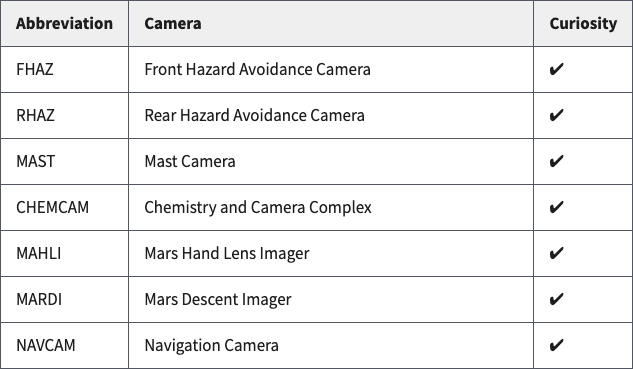
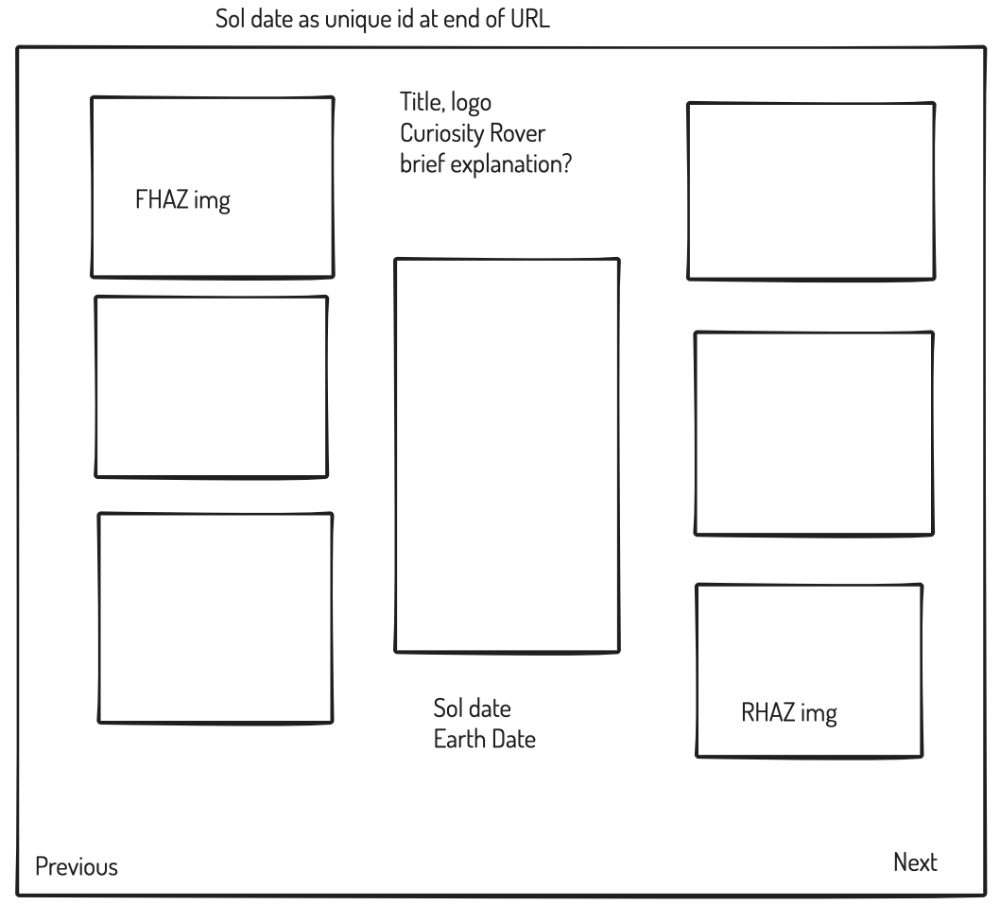
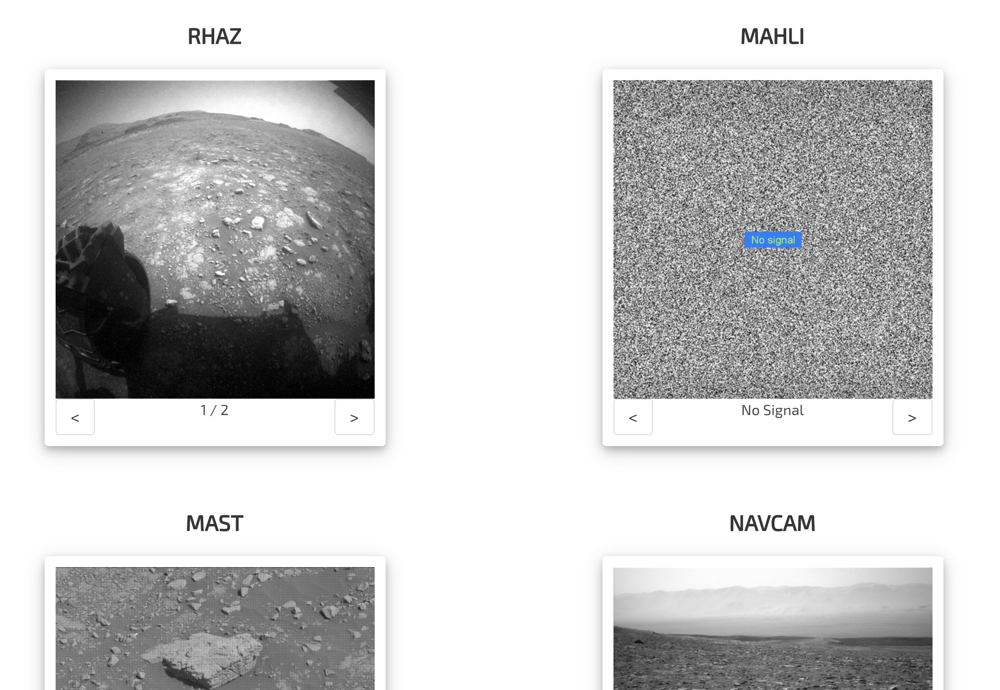

# Project 2: Curiosity Rover

## Overview 
For this project, we worked in pairs to build our first React application that consumes a public API. Dubbed ‘Mini Reactathon’, we had 48 hours to complete this. We used Visual Studio Live Share to collaborate in real time. 

You can find this deployed [here](https://mars-curiosity-rover-cam.netlify.app/).

### Web Technologies / Frameworks
* React
* JavaScript (ES6)
* HTML5 and CSS3
* Bulma

### Tools
* Zoom
* Github
* Visual Studio Live Share
* Ziteboard - White boarding 
* Slack

### Technical Requirements
* **Consume a public API** – this could be anything but it must make sense for your project.
* **Have several components** - At least one classical and one functional.
* **The app can have a router** - with several “pages”, this is up to your discretion and if it makes sense for your project.
* **Include wireframes** - that you designed before building the app.
* **Be deployed online** and accessible to the public.

## Approach
This was our first experience collaborating on a project as a pair and we had to do so remotely. As the project was all about consuming an external API, we started by exploring reputable APIs with good documentation.

### Explore API Endpoint | Mars Rover Concept - NASA API
As we browsed APIs for inspiration for our project idea, we stumbled across the NASA API and immediately began thinking about Mars exploration as we both followed the build up to the Perseverance Rover launch back in July 2020 and it’s landing in Feb 2021 on the Jezero Crater.  Although we couldn’t find an endpoint for the Perseverance Rover, we did find one for Curiosity.

We used the Mars Rover Photos API [NASA Open APIs](https://api.nasa.gov/) to access images from the on-board cameras and also query the mission manifest to allow us to browse by date. We thought it would be pretty cool to look around Mars on a given sol (Mars day). I decided to only display 6/7 camera feeds though as the MARDI cam wasn’t displaying great images.   

*Mars Rover API Table*



### Wireframe
Once we were happy with the endpoint data, we decided sketch out our idea as a wireframe to make sure we were visualising the same goal. 

*Camera View Wireframe*



### Set up React App
We used a custom template for our React application build:
`npx create-react-app project-2 —template cra-template-ga-ldn-projects —use-npm`

### Set up API request (Get and Show data)
We later decided to add a homepage to improve the user experience by providing some context around purpose and user interaction with the API. We separated our API requests in a `lib/api.js` file and created a `<CameraCard />` component to handle each of the 6 cameras above.  

#### Photos for a Given Day
The `Main.js` page is where the `<CameraCard />` is mounted. We append the user’s selected Sol Date to the URL which is then retrieved using React router’s `useParams`  as the `day` which is passed into the `getAllPhotos(day)` function to retrieve the images for the given day.

*App.js*
```
function App() {
  return (
    <BrowserRouter>
      <Switch>
        <Route exact path='/' component={Home} />
        <Route path='/:day' component={Main} />
      </Switch>
      <Footer />
    </BrowserRouter>
  )
}
```

*Main.js*
```
function Main() {
  const [allPhotos, setAllPhotos] = React.useState(null)
  const { day } = useParams()

  // * Fetch Data when the url changes
  React.useEffect(() => {
    // Get photos
    const getData = async () => {
      try {
        const res = await getAllPhotos(day)
        setAllPhotos(res.data)
      } catch (err) {
        console.log(err)
      }
    }
    getData()
  }, [day])

  // * Get an array of sorted images
  const getImages = (camera) => {
    if (allPhotos) {
      let num = 0
      return (
        allPhotos.photos.filter((photo) => {
          if (photo.camera.name === camera && num < 100) {
            num += 1
            return photo.camera.name === camera
          }
        })
      )
    }
  }
```

There was also a need for user input validation to ensure the API request is not rejected on the front end so we set the input field type to `Number` and set limitation on the minimum and maximum values against the mission manifest details. 

*Footer.js*
```
function Footer() {
  const [manifest, setManifest] = React.useState(null)
  const history = useHistory()

  // * Validate Sol Day against mission Manifest constraints
  const handleChange = (e) => {
    if (e.key === 'Enter' || e.key === 'ArrowUp' || e.key === 'ArrowDown') {
      if (Number(e.target.value) < 0) {
        history.push('/' + 0)
        e.target.value = 0
      } else if (Number(e.target.value) > Number(manifest.photo_manifest.max_sol)) {
        history.push('/' + manifest.photo_manifest.max_sol)
        e.target.value = manifest.photo_manifest.max_sol
      } else {
        console.log(e.target.value)
        history.push('/' + e.target.value)
      }
    }
  }
```

#### Browse Images (Increment / Decrement)
*CameraCard.js*
```
function CameraCard({ imgArray }) {
  const [index, setIndex] = React.useState(0)
  const { day } = useParams()

  // * Reset each card back to index 0 when url changes
  React.useEffect(() => {
    setIndex(0)
  }, [day])

  // * Use index as a click counter to inform which image to display
  const handleClick = (e) => {
    if (e.target.id === 'left' && index > 0) {
      setIndex(index - 1)
    } else if (e.target.id === 'right' && index < imgArray.length - 1) {
      setIndex(index + 1)
    }
  }
```

#### Conditionally Rendering Images (Fallback Gif)
To anticipate the event of no available images, we provided a fun fallback of a gif which displays a No Signal message.

*Camera Card*



*CameraCard.js*
```
 0 ?
      imgArray[index].img_src :
      'https://media2.giphy.com/media/l1J9EdzfOSgfyueLm/giphy.gif'
  }
/>
```

## Wins
* Building my first React application
* Effectively collaborating on a pair programming project remotely and overcoming technological challenges
* Getting more comfortable with React components
* Utilising conditional rendering effectively 


## Challenges
The main issue we had was working through React’s development errors while collaborating on a single server using Visual Studio’s Live Share extension from a slower machine. This was a new technology to me and it took some time to get a productive workflow going but we managed to work through it by discussing problems and solutions and working through them in chunks at a time. 

React was also quite difficult to grasp in the short time we had as I felt like it required an upfront investment in understanding rendering, hooks and effects as well as the component pattern. As for the components, although the temptation was there to go straight in, I found it really helped to refactor into components afterwards. 

## Key Learnings / Reflection
### Evaluating the use of CSS Frameworks for Projects 
Although it took a little while to understand how to get custom CSS to play nice with Bulma, particularly given that Bulma uses Flexbox, it became clear how much time it could save on time sensitive projects. While suitable for this project, I appreciate that creative freedoms are clearly limited with such frameworks and they may not always be appropriate.

### Better Utilisation of React Components
The beauty of React components is really appreciated when done efficiently. I would refactor the following blocks of code down to 1 component and dynamically change the camera names.  

*Main.js*
```
...
<div className="camera">
  <h4 className='title is-4 has-text-centered'>FHAZ</h4>
  <CameraCard
    imgArray={allPhotos ? getImages('FHAZ') : []}
  />
</div>
<div className="camera">
  <h4 className='title is-4 has-text-centered'>RHAZ</h4>
  <CameraCard
    imgArray={allPhotos ? getImages('RHAZ') : []}
  />
</div>
<div className="camera">
  <h4 className='title is-4 has-text-centered'>MAST</h4>
  <CameraCard
    imgArray={allPhotos ? getImages('MAST') : []}
  />
</div >
</div>
<div className="column camera-cards">
<div className="camera">
  <h4 className='title is-4 has-text-centered'>CHEMCAM</h4>
  <CameraCard
    imgArray={allPhotos ? getImages('CHEMCAM') : []}
  />
</div>
<div className="camera">
  <h4 className='title is-4 has-text-centered'>MAHLI</h4>
  <CameraCard
    imgArray={allPhotos ? getImages('MAHLI') : []}
  />
</div >
<div className="camera">
  <h4 className='title is-4 has-text-centered'>NAVCAM</h4>
  <CameraCard
    imgArray={allPhotos ? getImages('NAVCAM') : []}
  />
</div >
...
```

## Future Features
To make this project more visually immersive, I will create a space inspired theme and make the user input more engaging by adding animations. Initially I imagined it as a horizontal timeline where the user can slide the Sol Day to their desired date. 
